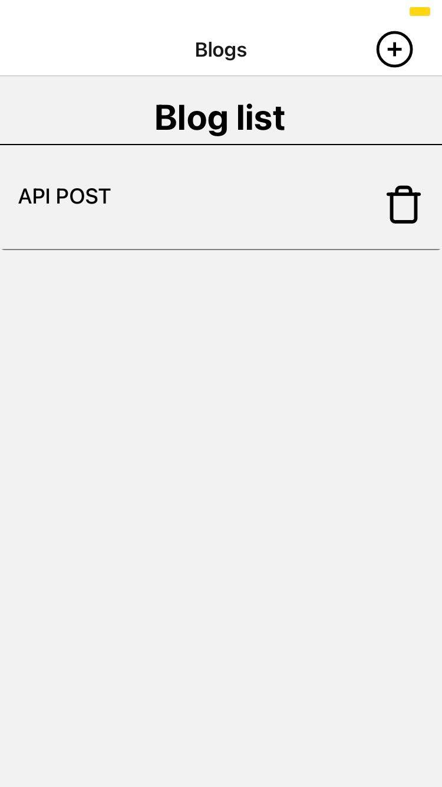
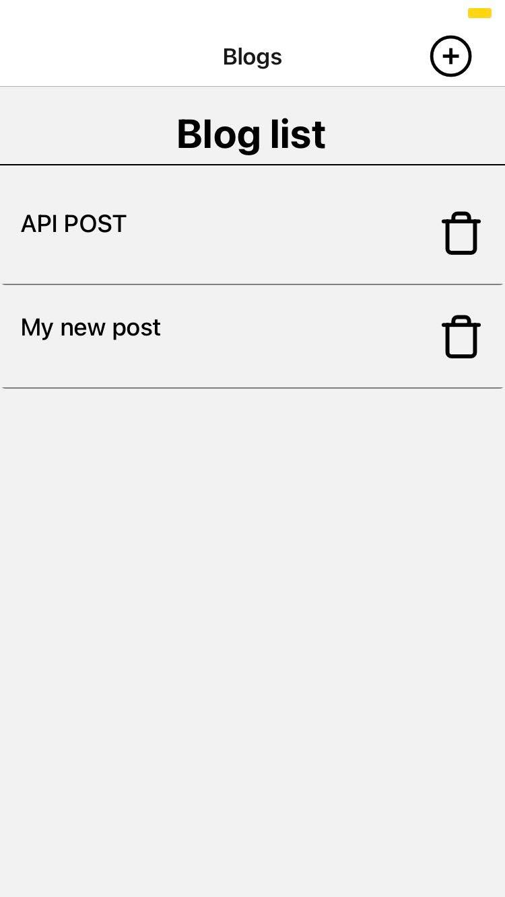
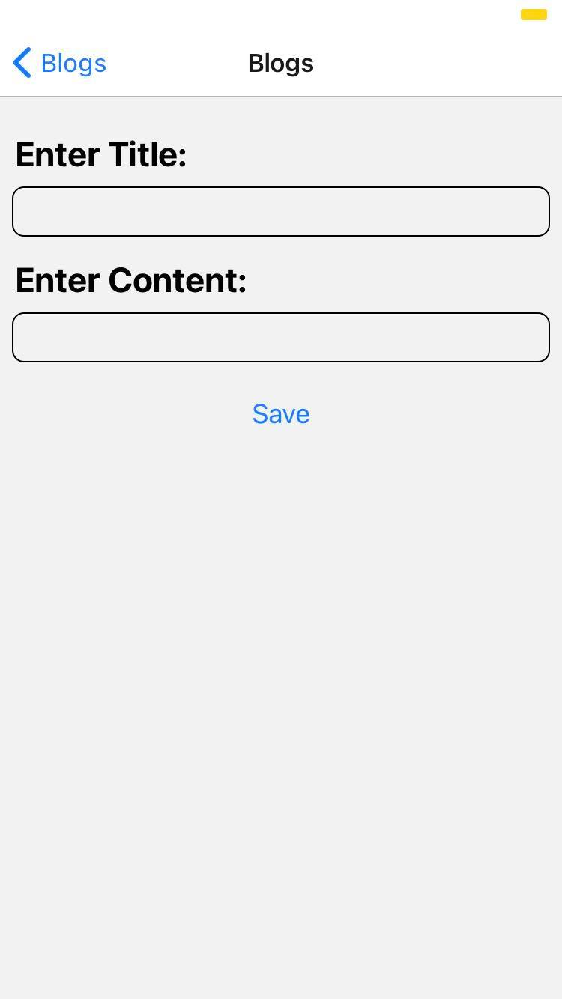
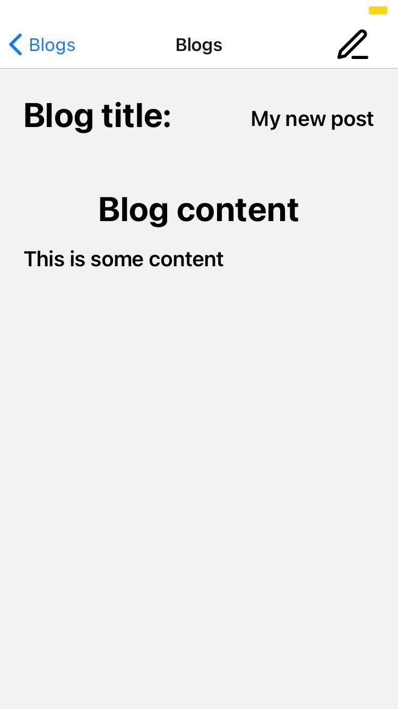
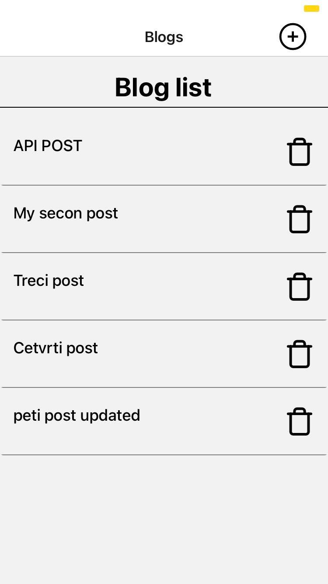
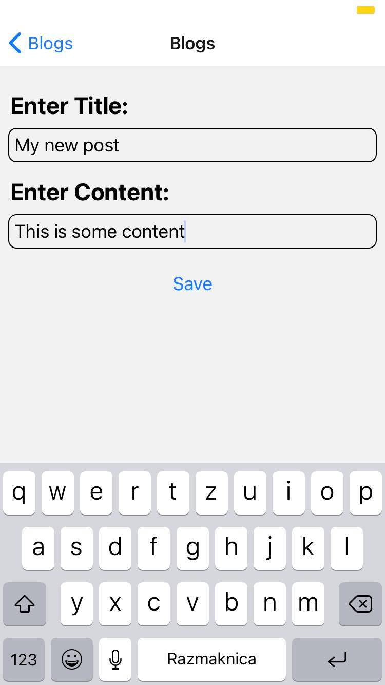

# Blog mobile application

## App startup

#### - download the repo from github 
#### - go inside that directory in terminal 
#### - run "npm install" to download dependencies 
#### - to start the app run "npm start"
#### - scan the QR code with Camera app on iOS / scan the QR code with Expo Go app on Android / open it on emulator 

 

Mobile app for Android/iOS made with React-Native. 
- The app provides all CRUD operations on data, where user can easily add/delete/modify his blog posts.
- In app communication with an API, and the whole app is running on custom JSON Server, with Ngrok establishing that connection. 
 
On the first screen user has a view of all his recent blog posts, there he can delete certain blog post, and by clicking on it the blog post details show 
on another screen.From that screen user has an ability to edit that post, where the app redirects him to a new edit screen where changes can be saved.
On every save the user is redirected to the appropriate screen.

### iOS

  
      
   

